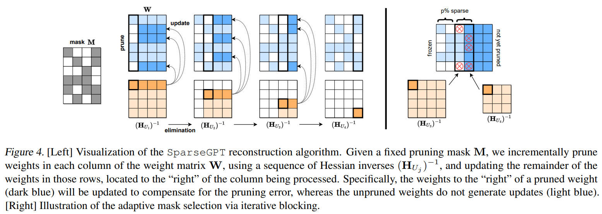

|    | meta                                       | title                                                                                                                                                                                                                                    | publication   |   year | code                                               | note                                       | cover                                                               |
|---:|:-------------------------------------------|:-----------------------------------------------------------------------------------------------------------------------------------------------------------------------------------------------------------------------------------------|:--------------|-------:|:---------------------------------------------------|:-------------------------------------------|:--------------------------------------------------------------------|
|  0 | [OpenVINO](../../meta/OpenVINO.prototxt)   | [Post-training deep neural network pruning via layer-wise calibration](https://openaccess.thecvf.com/content/ICCV2021W/LPCV/papers/Lazarevich_Post-Training_Deep_Neural_Network_Pruning_via_Layer-Wise_Calibration_ICCVW_2021_paper.pdf) | ICCV workshop |   2021 |                                                    |                                            |                                                                     |
|  1 | [SparseGPT](../../meta/sparsegpt.prototxt) | [SparseGPT: Massive Language Models Can be Accurately Pruned in one-shot.](https://arxiv.org/pdf/2301.00774.pdf)                                                                                                                         | arXiv         |   2023 | [Pytorch](https://github.com/IST-DASLab/sparsegpt) | [note](../../notes/sparsegpt/SparseGPT.md) |  |